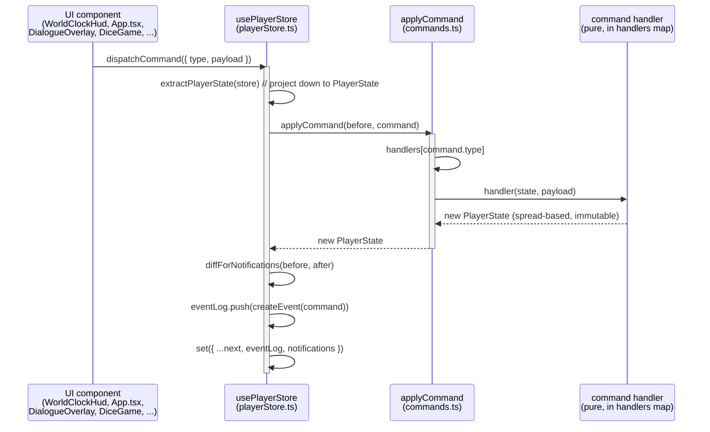
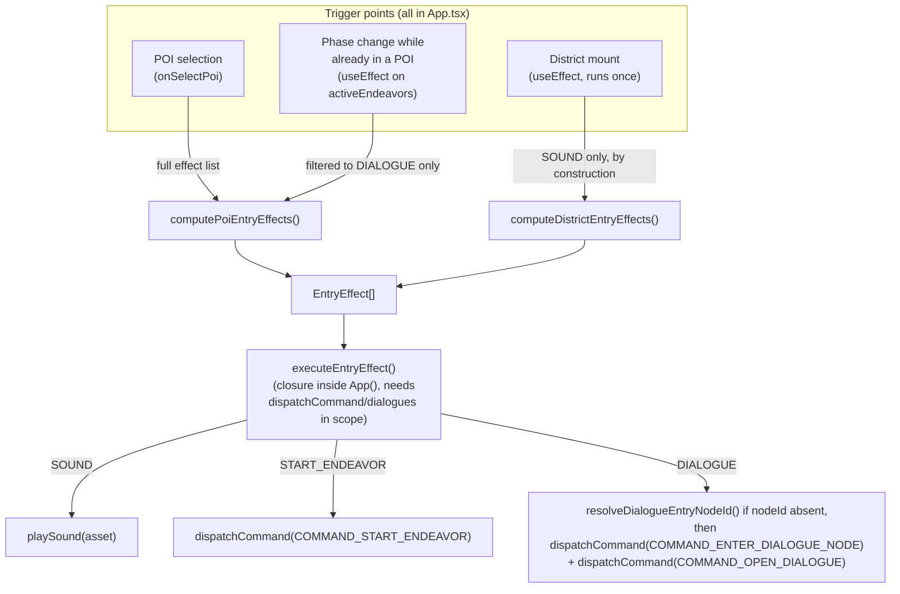
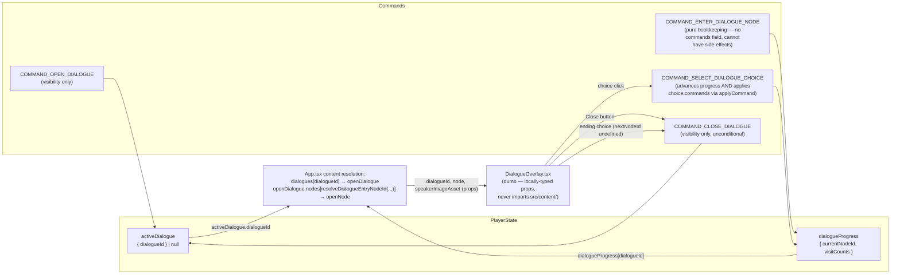
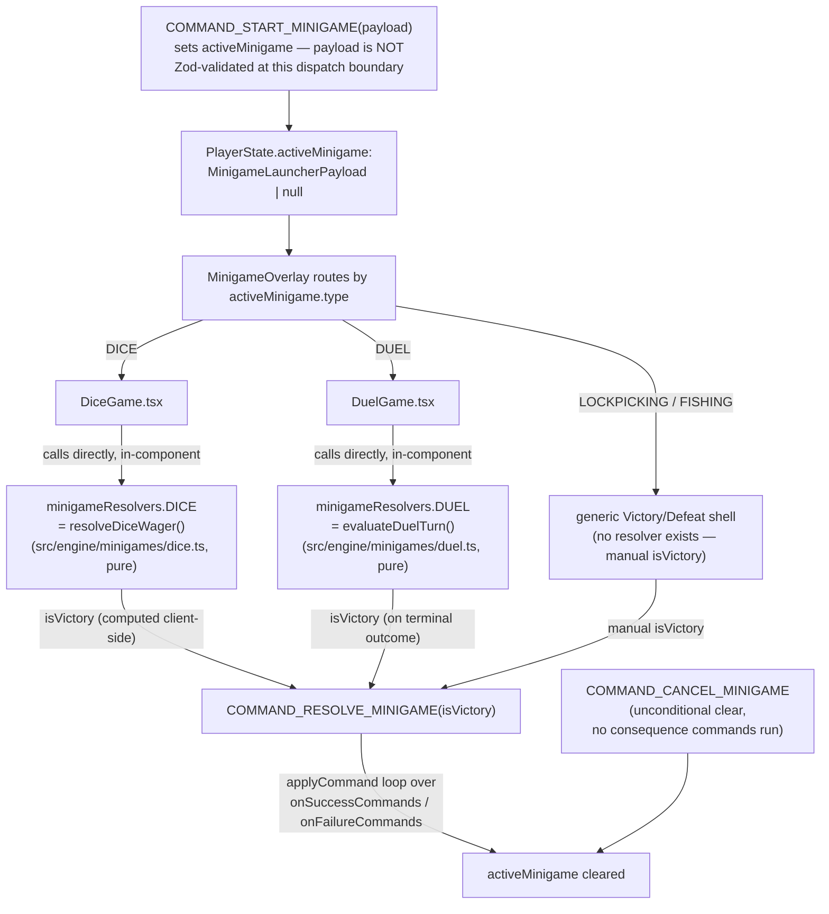

# Engine Architecture

An onboarding and running reference for how the engine's major pieces
actually interact — grounded in the current code, not the aspirational
version described elsewhere. This is a **living document**: per
`docs/feature-workflow.md` §2 stage 9 ("Docs sync"), any feature that changes
one of the flows below must update this file in the same phase.

For *what* the game is (domain rules, independent of implementation), see
`docs/game-design-spec.md`. For the concrete web-stack types and field
reference, see `docs/web-implementation.md`. This document sits between them:
how the pieces described there actually wire together at runtime.

---

## 1. CQRS Command Dispatch

All state changes flow through one pipeline: a UI component dispatches a
`StateCommand`, which is routed to a pure handler that returns a brand-new
`PlayerState`. No component ever mutates state directly.

**Routing.** `applyCommand` (`src/engine/store/commands.ts`) routes through a
`Record<CommandType, CommandHandler>` map, not a `switch` — one entry per
dispatchable command type.

**Recursion, not re-dispatch.** Two handlers apply their own nested commands
by calling `applyCommand` directly, never `dispatchCommand`:
- `COMMAND_RESOLVE_MINIGAME` loops the launched minigame's
  `onSuccessCommands`/`onFailureCommands` through `applyCommand`.
- `COMMAND_SELECT_DIALOGUE_CHOICE` loops the chosen `DialogueChoice.commands`
  through `applyCommand`.

Only the **outermost** `dispatchCommand` call produces one `eventLog` entry
and one notification diff — intermediate states inside a nested resolution
are invisible to both. This is why the notification system
(`docs/web-implementation.md` §10) derives events from a before/after diff of
the whole `PlayerState`, not from switching on the dispatched command's type.

**`COMMAND_NEXT_DAY` is internal-only.** It's a member of the `CommandType`
union but is excluded from `DispatchableCommandType` (`Exclude<CommandType,
"COMMAND_NEXT_DAY">`) and from `StateCommandSchema`'s discriminated union.
`applyCommand` throws if it's ever dispatched directly. It only ever runs as
a private call inside `applyAdvanceShift` when the shift rolls over past
`NIGHT` — never a UI-originated arrow into this diagram.

**The dispatch boundary is not runtime-validated.** `StateCommandSchema`
(Zod) validates content-authored commands at content-load time and at
save-import time — it does **not** validate `dispatchCommand`'s input at the
`playerStore.ts` call boundary. A malformed command built directly in a
component (rather than sourced from content JSON) would reach a handler
unchecked. This is a deliberate, documented gap, not an oversight.

**Purity scope.** Every handler in the `handlers` map is a pure function of
`(state, payload) → PlayerState`, confirmed spread-based with no mutation.
`CONTRIBUTING.md`'s "command handlers are pure where possible" claim is
accurate and scopes itself correctly — it's the *handler* layer that's pure.
The store layer wrapping it (`playerStore.ts`) is not, by design:
`dispatchCommand` itself calls `Date.now()` (non-deterministic) and mutates
the Zustand store via `set`; `exportSave`/`importSave` do Blob/DOM/File I/O;
`devSetWorldClock` bypasses `applyCommand`/`StateCommand` entirely as a
documented dev-only escape hatch gated on `import.meta.env.DEV`.

---

## 2. EntryEffect Trigger/Execution Pattern

A generic, typed way for "the player arrived somewhere" to produce a sound,
open a dialogue, or auto-start an Endeavor — without `src/engine/` ever
reading content data itself.

**Effect types** (`src/engine/utils/entryEffects.ts`):
- `{ type: "SOUND"; asset: string }` — a one-shot SFX from a POI's or
  District's `entrySoundAsset`.
- `{ type: "DIALOGUE"; dialogueId: string; nodeId?: string }` — from an
  active Endeavor phase's `autoDialogueOnEnter`, or paired with...
- `{ type: "START_ENDEAVOR"; endeavorId: string; initialPhaseId: string }` —
  from an unstarted Endeavor's `autoStartOnEnter`. Always pushed together
  with a matching `DIALOGUE` effect in the same computation.

**Why three trigger points, not one.** POI selection fires the full effect
list (a genuinely new arrival). District mount only ever produces `SOUND`
(district-level `autoDialogueOnEnter` doesn't exist — it's POI-scoped). The
phase-change effect exists because a phase transition can make a dialogue
trigger newly applicable *while the player is already standing in that POI*
— `onSelectPoi` only fires at the moment of selection and would miss this.
It's deliberately narrowed to `DIALOGUE` only: replaying entry SFX or
re-starting an Endeavor on every unrelated phase change would be a
regression, and it's guarded to never fire over an already-open dialogue.

`START_ENDEAVOR` is a third, real variant (`entryEffects.ts:10-13`, driven by
`Endeavor.autoStartOnEnter`) — see `docs/features/feature_dialogue_visibility_and_auto_triggers.md`'s
addendum section for its full design rationale.

---

## 3. Dialogue System

`PlayerState.activeDialogue: { dialogueId: string } | null` controls
*visibility* — kept deliberately separate from `dialogueProgress`, which
tracks conversation position independent of whether the overlay is open.

**The OPEN/CLOSE vs ENTER_NODE/SELECT_CHOICE split is deliberate**, mirroring
itself: `COMMAND_ENTER_DIALOGUE_NODE` stays pure bookkeeping (no `commands`
field in its payload at all — it *cannot* have side effects, by
construction, not convention); `COMMAND_SELECT_DIALOGUE_CHOICE` always
carries a `commands: StateCommand[]` (possibly empty) because a choice
selection is never "just" bookkeeping. `COMMAND_OPEN_DIALOGUE` is dispatched
immediately after `COMMAND_ENTER_DIALOGUE_NODE` everywhere a dialogue opens —
an actor click, an `EntryEffect` DIALOGUE trigger, or a minigame's
`onSuccessCommands`/`onFailureCommands` listing both in sequence.
`COMMAND_CLOSE_DIALOGUE` mirrors `COMMAND_CANCEL_MINIGAME` exactly:
unconditional, no guard.

**Content resolution is `App.tsx`'s job, not `DialogueOverlay`'s.**
`DialogueOverlay` receives a fully-resolved `node`/`dialogueId` as props — it
never touches `src/content/` itself (`src/engine/` boundary, §5 below).
`App.tsx` turns the store's `activeDialogue`/`dialogueProgress` references
into real content: `dialogues[activeDialogue.dialogueId]` →
`resolveDialogueEntryNodeId(openDialogue, dialogueProgress[openDialogue.id])`
to pick the current node. `resolveDialogueEntryNodeId` itself lives in
`src/dialogueResolution.ts` — deliberately *outside* `src/engine/`, since it
needs `src/content/schemas`' `Dialogue` type and is never called from the
pure reducer. The speaking actor's portrait is matched by `Actor.name`
against `node.speaker`, not by `Actor.dialogueId` — a scene an Actor appears
in (an auto-triggered dialogue, or a minigame outcome) is often not that
Actor's own home dialogue.

No discrepancy found — this subsystem matches `docs/web-implementation.md`
closely.

---

## 4. Minigame System

`MinigameLauncherPayload` is a discriminated union on `type`. Only `DICE` and
`DUEL` have a real per-type `config` shape and a real resolver; `LOCKPICKING`
and `FISHING` share an untyped `Record<string, unknown>` config bag and have
no resolver at all — deliberately unimplemented, not stubbed, per
`game-design-spec.md`'s open design gap.

**The command layer never calls a resolver.** This is the one detail worth
drawing precisely: `COMMAND_START_MINIGAME` only ever writes `activeMinigame`
(the launch config). Resolution — `minigameResolvers.DICE`/`.DUEL` — is
called **directly from inside the React component** (`DiceGame.tsx`'s
`throwDice()`, `DuelGame.tsx`'s `chooseAction()`) as session-local play
happens, using an injectable `RandomSource` for deterministic tests.
`COMMAND_RESOLVE_MINIGAME` only ever consumes an already-computed
`isVictory` boolean to pick and apply the fixed `onSuccessCommands`/
`onFailureCommands` list baked into the launch payload. Both resolvers are
pure: `resolveDiceWager(wager, random)` (no context beyond wager + RNG);
`evaluateDuelTurn(context, playerAction, opponentAction)` (no RNG at all —
turn resolution is deterministic; `chooseOpponentAction` is the separate,
RNG-using opponent-AI heuristic).

`COMMAND_CANCEL_MINIGAME` is distinct from resolving with a loss: it clears
`activeMinigame` with **no** consequence commands run at all, for backing out
before an outcome exists (e.g. a wager the player can no longer afford).

No discrepancy found — `docs/web-implementation.md` §9 describes this file
layout and "components call resolvers directly" pattern accurately, and
confirms `DUEL` has no in-content trigger yet (engine-only, reachable only by
manually opening it).

---

## 5. `src/engine` ↔ `src/content` Boundary

This is the single most load-bearing architectural rule in the project:
**`src/engine/` may never import from `src/content/`, in any form.**
Content flows into the running app exclusively through a bridge layer that
sits *outside* `src/engine/` entirely.

```mermaid
flowchart LR
    subgraph Content["src/content/"]
        JSON["*.json<br/>(pure data, zero imports)"]
        Schemas["schemas/*.schema.ts<br/>(Zod validators)"]
    end

    subgraph Bridge["Bridge layer — outside src/engine/"]
        App["src/App.tsx<br/>(static JSON imports)"]
        Loader["src/contentLoader.ts<br/>loadContent(schema, raw, label)<br/>→ schema.safeParse(), throws on failure"]
        Resolution["src/dialogueResolution.ts<br/>src/notificationResolution.ts<br/>(need src/content/ types)"]
    end

    subgraph EngineT["src/engine/types/"]
        Types["TS types +<br/>their Zod mirrors<br/>(StateCommandSchema, SHIFTS, ...)<br/>— the shared vocabulary"]
    end

    subgraph Engine["src/engine/ (components, store, minigames, utils)"]
        Comp["Components take fully-resolved<br/>data as props — never import<br/>src/content/ themselves"]
    end

    JSON -->|raw import| App
    App -->|"raw + schema"| Loader
    Loader -->|"validated, defaulted content"| App
    App -->|"props / dispatch payloads"| Comp
    App -->|resolves names/nodes via| Resolution

    Schemas -.->|"imports types AND\nruntime Zod values\n(dialogue.schema.ts, shared.ts)"| Types
    Loader -.->|imports| Schemas

    Types -.->|"NEVER: src/engine importing\nfrom src/content"| Content
    Engine -.->|"NEVER"| Content

    style Content fill:#2d3a2d,stroke:#4a7a4a
    style Bridge fill:#2d2d3a,stroke:#4a4a7a
    style EngineT fill:#3a2d2d,stroke:#7a4a4a
    style Engine fill:#3a2d2d,stroke:#7a4a4a
```

**The rule, precisely, as enforced by the actual code** (confirmed via a
full grep of `src/engine/` for any `src/content/` import — zero hits, one
unrelated `.json` string literal that's a save-file *download filename*, not
a content import):

- `src/content/*.json` — pure data. No imports at all.
- `src/content/schemas/*.schema.ts` — imports `zod` and sibling `./shared`.
  Two files (`dialogue.schema.ts`, `shared.ts`) additionally import **from**
  `src/engine/types` — both a TS `type` (`DialogueRequirement`) and a real
  runtime Zod value (`StateCommandSchema`, `SHIFTS`). So schemas are allowed
  to depend on `src/engine/types` (where the shared vocabulary of types and
  their Zod mirrors lives) — this is the one sanctioned cross-boundary
  import, and it only ever runs in this direction.
- `src/engine/**` — zero imports from `src/content/`, of any kind. Verified
  by grep, not assumed; several files carry self-documenting comments
  confirming this is deliberate (`DialogueOverlay.tsx`, `ManagementDrawer.tsx`,
  `entryEffects.ts`).
- `src/App.tsx` + `src/contentLoader.ts` — both at `src/` root, siblings of
  `src/engine/`, **outside** it — are the only bridge. Every content JSON
  file `App.tsx` imports is piped through `loadContent(schema, raw, label)`
  before use, which matters concretely: a schema field with `.default(...)`
  (e.g. an omitted `DialogueChoice.commands`) is only ever defaulted when
  data is actually run through `.safeParse()` — a raw static `import`
  returns the JSON exactly as authored, omitted fields and all. Validated,
  defaulted content is then handed into `src/engine/` components purely as
  props or command-dispatch payloads — never as a direct import.

**Content-derived data reaching a command handler or a component always
travels as data the caller already resolved** — a POI's `costShifts` becomes
part of a `COMMAND_MOVE_TO_POI` payload; an Endeavor phase's
`unlocksNodesOnComplete` becomes part of a `COMMAND_ADVANCE_ENDEAVOR_PHASE`
payload. `src/engine/` never looks these up itself, by construction — it has
no way to.
